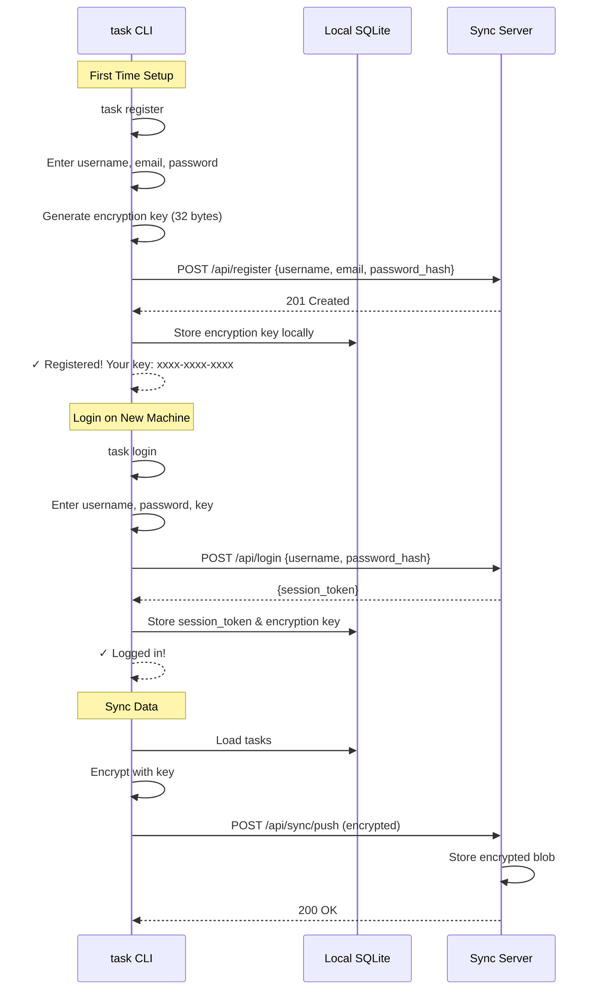
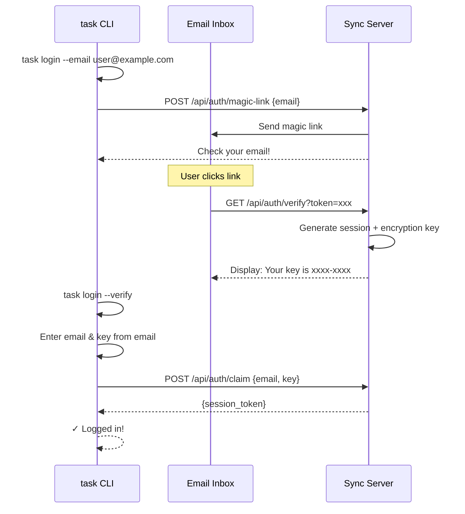

# IronTask - Authentication Flow Design

## Overview

Authentication supports two methods:
1. **Basic Auth** (like Atuin) - Username + Password + Encryption Key
2. **Email Magic Link** - Passwordless login via email

---

## Authentication Flow Diagrams

### Option 1: Basic Auth (Recommended)



### Option 2: Email Magic Link



---

## CLI Commands

```bash
# Register (first time)
$ task register
Username: tphuc
Email: tphuc@example.com
Password: ********
Confirm password: ********

✓ Registered successfully!
⚠️ Your encryption key (save this!):
   iron-task-a3f2-b8c1-d4e5-f6a7

# Login on new machine
$ task login
Username: tphuc
Password: ********
Encryption key: iron-task-a3f2-b8c1-d4e5-f6a7

✓ Logged in! Syncing...

# View your key
$ task key
iron-task-a3f2-b8c1-d4e5-f6a7

# Logout
$ task logout
✓ Logged out. Local data preserved.
```

---

## TUI Login Flow

```
┌─────────────────────────────────────────────────────────────────────────────┐
│  ◉ IronTask                                               ○ Not logged in   │
├─────────────────────────────────────────────────────────────────────────────┤
│                                                                             │
│                     ╭─── Welcome to IronTask ───╮                           │
│                     │                           │                           │
│                     │  Sync your tasks across   │                           │
│                     │  all your devices         │                           │
│                     │                           │                           │
│                     │  [1] Register             │                           │
│                     │  [2] Login                │                           │
│                     │  [3] Continue offline     │                           │
│                     │                           │                           │
│                     ╰───────────────────────────╯                           │
│                                                                             │
├─────────────────────────────────────────────────────────────────────────────┤
│  Press 1, 2, or 3 to continue                                               │
└─────────────────────────────────────────────────────────────────────────────┘
```

```
┌─────────────────────────────────────────────────────────────────────────────┐
│  ◉ IronTask                                               ○ Not logged in   │
├─────────────────────────────────────────────────────────────────────────────┤
│                                                                             │
│                     ╭─── Register ───────────────╮                          │
│                     │                            │                          │
│                     │  Username: tphuc_          │                          │
│                     │  Email:    tphuc@email.com │                          │
│                     │  Password: ********        │                          │
│                     │  Confirm:  ********        │                          │
│                     │                            │                          │
│                     │  [Enter] Register          │                          │
│                     │  [Esc] Back                │                          │
│                     │                            │                          │
│                     ╰────────────────────────────╯                          │
│                                                                             │
├─────────────────────────────────────────────────────────────────────────────┤
│  Tab to switch fields • Enter to submit • Esc to cancel                     │
└─────────────────────────────────────────────────────────────────────────────┘
```

---

## Data Models

```go
// User account (server-side)
type User struct {
    ID           string    `json:"id"`
    Username     string    `json:"username"`
    Email        string    `json:"email"`
    PasswordHash string    `json:"-"`
    CreatedAt    time.Time `json:"created_at"`
}

// Session token (server-side)
type Session struct {
    ID        string    `json:"id"`
    UserID    string    `json:"user_id"`
    Token     string    `json:"token"`    // API token for requests
    ExpiresAt time.Time `json:"expires_at"`
    CreatedAt time.Time `json:"created_at"`
}

// Local auth config (~/.irontask/config.toml)
// [sync]
// server = "https://sync.irontask.dev"
// session_token = "xxx"
// encryption_key = "iron-task-a3f2-b8c1-d4e5-f6a7"
```

---

## API Endpoints

| Method | Path | Description |
|--------|------|-------------|
| `POST` | `/api/register` | Create account |
| `POST` | `/api/login` | Get session token |
| `POST` | `/api/logout` | Invalidate session |
| `GET` | `/api/me` | Get current user info |
| `POST` | `/api/auth/magic-link` | Request email login |
| `GET` | `/api/auth/verify` | Verify magic link |

---

## Security Considerations

1. **End-to-End Encryption**
   - Tasks are encrypted client-side before sending
   - Server only stores encrypted blobs
   - Key never leaves the client (except user backup)

2. **Password Storage**
   - bcrypt with cost factor 12
   - Never log or expose passwords

3. **Session Tokens**
   - 256-bit random tokens
   - Expire after 30 days
   - Refresh on each sync

4. **Rate Limiting**
   - Login: 5 attempts/minute
   - Register: 3 attempts/hour per IP

---

## Implementation Plan

**Both methods will be supported from the start:**

1. **Phase 1: Basic Auth** (required for sync)
   - Register with username/email/password
   - Login with credentials + encryption key
   - Session token management

2. **Phase 2: Email Magic Link** (alternative login)
   - Request magic link via email
   - Verify and claim session
   - Uses same encryption key system

**Email Service Options:**
- Self-hosted: SMTP configuration
- Cloud: Resend, SendGrid, or AWS SES
