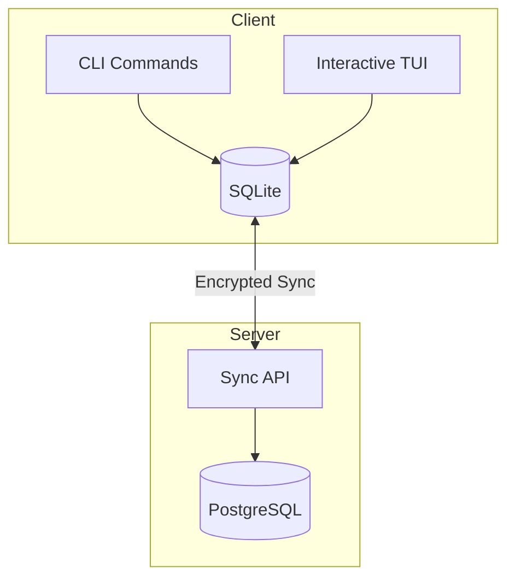

# IronTask - Terminal Todo App with Sync

A Go-based terminal todo application inspired by Atuin's sync model. Features both CLI commands and interactive TUI, with SQLite local storage and optional cloud/self-hosted sync.

## Design Documents

- [TUI Design](file:///Users/tphuc/coding/iron/irontask/docs/tui_design.md) - Terminal UI/UX mockups
- [Auth Design](file:///Users/tphuc/coding/iron/irontask/docs/auth_design.md) - Authentication flows (Basic + Magic Link)

---

## Architecture Overview



---

## Proposed Changes

### Core Project Structure

```
irontask/
├── cmd/
│   ├── irontask/          # CLI entrypoint
│   │   └── main.go
│   └── irontask-server/   # Sync server entrypoint
│       └── main.go
├── internal/
│   ├── db/                # SQLite layer
│   │   ├── db.go
│   │   ├── migrations.go
│   │   └── queries.go
│   ├── model/             # Domain models
│   │   ├── project.go
│   │   └── task.go
│   ├── cli/               # CLI commands
│   │   ├── add.go
│   │   ├── list.go
│   │   ├── done.go
│   │   └── sync.go
│   ├── tui/               # TUI components
│   │   ├── app.go
│   │   ├── list.go
│   │   └── styles.go
│   └── sync/              # Sync client
│       ├── client.go
│       └── queue.go
├── server/                # Sync server
│   ├── handler/
│   ├── middleware/
│   └── store/
├── go.mod
├── go.sum
└── README.md
```

---

### Component: Domain Models

#### [NEW] [project.go](file:///Users/tphuc/coding/iron/irontask/internal/model/project.go)

```go
type Project struct {
    ID          string    `json:"id"`           // UUID
    Name        string    `json:"name"`         // Project name
    Color       string    `json:"color"`        // Hex color for TUI
    Archived    bool      `json:"archived"`     // Hide from default view
    CreatedAt   time.Time `json:"created_at"`
    UpdatedAt   time.Time `json:"updated_at"`
    DeletedAt   *time.Time `json:"deleted_at"`  // Soft delete for sync
    SyncVersion int64     `json:"sync_version"`
}
```

#### [NEW] [task.go](file:///Users/tphuc/coding/iron/irontask/internal/model/task.go)

```go
type Task struct {
    ID          string    `json:"id"`           // UUID
    ProjectID   string    `json:"project_id"`   // Foreign key to Project
    Content     string    `json:"content"`      // Task description
    Done        bool      `json:"done"`         // Completion status
    Priority    int       `json:"priority"`     // 1-4 (1=highest)
    DueDate     *time.Time `json:"due_date"`   // Optional due date
    Tags        []string  `json:"tags"`         // Categories
    CreatedAt   time.Time `json:"created_at"`
    UpdatedAt   time.Time `json:"updated_at"`
    DeletedAt   *time.Time `json:"deleted_at"` // Soft delete for sync
    SyncVersion int64     `json:"sync_version"` // For conflict resolution
}
```

---

### Component: SQLite Database

#### [NEW] [db.go](file:///Users/tphuc/coding/iron/irontask/internal/db/db.go)

- Initialize SQLite database at `~/.irontask/tasks.db`
- Run migrations on startup
- Connection pooling with `modernc.org/sqlite` (pure Go, no CGO)

#### [NEW] [migrations.go](file:///Users/tphuc/coding/iron/irontask/internal/db/migrations.go)

```sql
-- Projects table
CREATE TABLE IF NOT EXISTS projects (
    id TEXT PRIMARY KEY,
    name TEXT NOT NULL,
    color TEXT DEFAULT '#4ECDC4',
    archived INTEGER DEFAULT 0,
    created_at TEXT NOT NULL,
    updated_at TEXT NOT NULL,
    deleted_at TEXT,
    sync_version INTEGER DEFAULT 0
);

-- Default "Inbox" project
INSERT OR IGNORE INTO projects (id, name, color, created_at, updated_at)
VALUES ('inbox', 'Inbox', '#6C757D', datetime('now'), datetime('now'));

-- Tasks table with project reference
CREATE TABLE IF NOT EXISTS tasks (
    id TEXT PRIMARY KEY,
    project_id TEXT NOT NULL DEFAULT 'inbox',
    content TEXT NOT NULL,
    done INTEGER DEFAULT 0,
    priority INTEGER DEFAULT 4,
    due_date TEXT,
    tags TEXT,
    created_at TEXT NOT NULL,
    updated_at TEXT NOT NULL,
    deleted_at TEXT,
    sync_version INTEGER DEFAULT 0,
    FOREIGN KEY (project_id) REFERENCES projects(id)
);

CREATE TABLE IF NOT EXISTS sync_state (
    key TEXT PRIMARY KEY,
    value TEXT
);
```

---

### Component: CLI Commands

Using [cobra](https://github.com/spf13/cobra) for CLI framework.

**Project Commands:**
| Command | Description |
|---------|-------------|
| `irontask project new "Work"` | Create a new project |
| `irontask project list` | List all projects |
| `irontask project delete <id>` | Delete a project |

**Task Commands:**
| Command | Description |
|---------|-------------|
| `irontask add "Buy groceries"` | Add to Inbox (default) |
| `irontask add "Feature" --project work` | Add to specific project |
| `irontask list` | List all pending tasks |
| `irontask list --project work` | List tasks in project |
| `irontask done <id>` | Mark task complete |
| `irontask delete <id>` | Delete a task |
| `task move <id> <project>` | Move task to project |

**Other:**
| Command | Description |
|---------|-------------|
| `irontask sync` | Manual sync |
| `task login` | Auth with sync server |
| `task` (no args) | Launch TUI |

---

### Component: Interactive TUI

Using [bubbletea](https://github.com/charmbracelet/bubbletea) + [lipgloss](https://github.com/charmbracelet/lipgloss).

**Features:**
- Vim-style navigation (`j`/`k`, `gg`/`G`)
- Quick add with `a`
- Mark done with `x` or `Enter`
- Delete with `d`
- Filter by tag with `/`
- Sync status indicator

---

### Component: Sync Server

#### [NEW] [server/main.go](file:///Users/tphuc/coding/iron/irontask/cmd/irontask-server/main.go)

**Endpoints:**
| Method | Path | Description |
|--------|------|-------------|
| `POST` | `/api/register` | Create account |
| `POST` | `/api/login` | Get API key |
| `GET` | `/api/sync/pull` | Fetch changes since version |
| `POST` | `/api/sync/push` | Upload local changes |

**Sync Strategy (like Atuin):**
1. Each task has a `sync_version` (monotonic counter)
2. Client tracks `last_sync_version`
3. Pull: Get all tasks with `sync_version > last_sync_version`
4. Push: Upload tasks modified since last sync
5. Conflict: Last-write-wins based on `updated_at`

---

## Dependencies

```go
// go.mod
require (
    github.com/spf13/cobra v1.8.0        // CLI framework
    github.com/charmbracelet/bubbletea v0.25.0  // TUI
    github.com/charmbracelet/lipgloss v0.9.1    // TUI styling
    modernc.org/sqlite v1.28.0           // Pure Go SQLite
    github.com/google/uuid v1.5.0        // UUIDs
)
```

---

## Verification Plan

### Automated Tests
```bash
# Unit tests
go test ./...

# Build verification
go build ./cmd/irontask
go build ./cmd/irontask-server
```

### Manual Verification
1. Add tasks via CLI, verify in TUI
2. Complete tasks in TUI, verify in CLI
3. Start two clients, sync between them
4. Test offline mode (queue tasks, sync when online)
